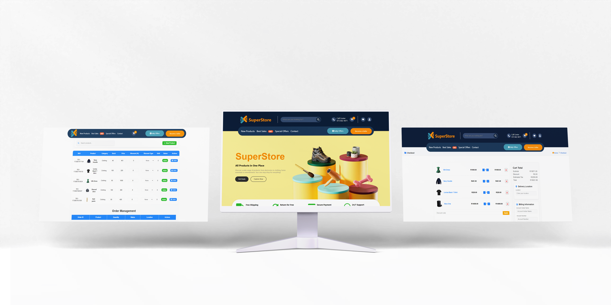

# 🛍️ SuperStore

Welcome to **SuperStore**, a user-driven e-commerce platform where buyers and sellers can connect seamlessly. Built with **React** and **Firebase**, this platform enables secure transactions and real-time management of orders and inventory. Sellers can manage their products, track stock, and accept orders, while customers enjoy a smooth shopping experience with order tracking capabilities.

## Table of Contents
- [Features](#-features)
- [Mockups](#-mockups)
- [Tech Stack](#-tech-stack)
- [Project Setup](#-project-setup)
- [Database Structure](#-database-structure)
- [Project Structure](#-project-structure)
- [ERD Diagram](#-erd-diagram)
- [Documentation](#-documentation)
- [Demo](#-demo)
- [Author](#-author)


## 🚀 Features

- **User Authentication:** Secure sign-up/login using Firebase with Google and email options.
- **Seller Dashboard:** Product management, stock tracking, and low-stock notifications for sellers.
- **Order Management:** Real-time order approval and inventory control.
- **Customer Shopping:** Browse products, add items to the cart, complete purchases, and track order status.

## 📸 Mockups

Check out our mockups to visualize SuperStore's interface:

- **Landing Page:** [Mockup Link](/frontend/src/assets/ScreenShot1.png)
- **Seller Dashboard:** [Mockup Link](/frontend/src/assets/ScreenShot2.png)
- **Order Summary Page:** [Mockup Link](/frontend/src/assets/ScreenShot3.png)


## 🛠️ Tech Stack


- **Frontend:** React
- **Backend/Database:** Firebase Firestore
- **Hosting:** Firebase
- **Version Control:** GitHub
- **Development Environment:** Visual Studio Code

Frontend: React
Backend/Database: Firebase Firestore
Hosting: Firebase
Version Control: GitHub
Development Environment: Visual Studio Code

## 🏗️ Project Setup

To run the SuperStore project on your local machine, follow these steps:

### 1. Clone the Repository


git clone https://github.com/EnzoDV08/SuperStore_DV200_Term_4.git
cd SuperStore_DV200_Term_4
2. Install Dependencies
Navigate to the frontend folder and install dependencies:


cd frontend
npm install
3. Set Up Firebase
Go to the Firebase Console.
Create a new project named "SuperStore" (or any preferred name).
Add a web app to your project and set up Firebase Hosting if you wish to deploy.
Copy the Firebase configuration and paste it into a .env file in the frontend directory.

REACT_APP_FIREBASE_API_KEY=your-api-key
REACT_APP_FIREBASE_AUTH_DOMAIN=your-auth-domain
REACT_APP_FIREBASE_PROJECT_ID=your-project-id
REACT_APP_FIREBASE_STORAGE_BUCKET=your-storage-bucket
REACT_APP_FIREBASE_MESSAGING_SENDER_ID=your-messaging-sender-id
REACT_APP_FIREBASE_APP_ID=your-app-id
4. Run the Project
In the frontend folder, run the application:


npm start
The application should now be running on http://localhost:3000.

5. Deployment
To deploy the app to Firebase Hosting, use these commands:


firebase login
firebase init
firebase deploy

## 🔄 Database Structure

SuperStore’s Firebase Firestore database is structured to manage user information, product listings, order tracking, and cart items. Below is an overview of each main collection and its purpose, followed by a sample structure for key fields.

### Collections Overview

- **Users**: Manages user profiles, including whether they are sellers or buyers and stores relevant account details.
- **Products**: Holds details for each product, such as title, description, price, stock level, and the associated seller.
- **Orders**: Tracks order-related information, including the customer’s details, status of the order, and items in the order.
- **Carts**: Stores items that users add to their shopping carts on a per-user basis.

### Sample Document Structures

#### 1. `users` Collection

| **Field**    | **Type**   | **Description**                             |
|--------------|------------|---------------------------------------------|
| `name`       | String     | The user’s name                             |
| `email`      | String     | The user’s email address                    |
| `isSeller`   | Boolean    | Indicates whether the user is a seller      |
| `address`    | Map        | Contains address details for the user       |
| `createdAt`  | Timestamp  | The date the user account was created       |

#### 2. `products` Collection

| **Field**       | **Type**     | **Description**                           |
|-----------------|--------------|-------------------------------------------|
| `title`         | String       | The product title                         |
| `description`   | String       | A detailed description of the product     |
| `price`         | Number       | Price of the product                      |
| `stock`         | Number       | Current stock available for the product   |
| `sellerId`      | Reference    | Reference to the seller's user document   |
| `createdAt`     | Timestamp    | Date when the product was added           |

#### 3. `orders` Collection

| **Field**       | **Type**       | **Description**                                   |
|-----------------|----------------|---------------------------------------------------|
| `userId`        | Reference      | Reference to the user (customer) document         |
| `items`         | Array          | Array of items included in the order              |
| `status`        | String         | Status of the order (e.g., Pending, Shipped)      |
| `totalPrice`    | Number         | Total amount for the order                        |
| `orderDate`     | Timestamp      | Date when the order was placed                    |

Each collection is carefully organized to enable efficient retrieval and management of data within the platform, ensuring a seamless experience for both sellers and buyers.


## 📂 Project Structure

```plaintext
SUPERSTORE_DV200_TERM_4/
├── backend/                 # Backend code (if applicable)
├── frontend/                # Main frontend project folder
│   ├── build/               # Compiled project files
│   ├── node_modules/        # Project dependencies
│   ├── public/              # Public assets and files
│   ├── src/                 # Source files
│   │   ├── assets/          # Images, icons, and other assets
│   │   ├── components/      # Reusable UI components
│   │   │   ├── Breadcrumbs.js
│   │   │   ├── Categories.js
│   │   │   ├── Filter.js
│   │   │   ├── Footer.js
│   │   │   ├── LargeProductCard.js
│   │   │   ├── Navbar.js
│   │   │   ├── OrderManagement.js
│   │   │   ├── ProductCard.js
│   │   │   └── Sidebar.js
│   │   ├── contexts/        # Context API for global state management
│   │   │   ├── AuthContext.js
│   │   │   └── CartContext.js
│   │   ├── pages/           # Individual pages of the application
│   │   │   ├── AccountBilling.js
│   │   │   ├── AccountDetails.js
│   │   │   ├── CheckoutPage.js
│   │   │   ├── CompareProducts.js
│   │   │   ├── Dashboard.js
│   │   │   ├── HomePage.js
│   │   │   ├── HotDeals.js
│   │   │   ├── OrderSummary.js
│   │   │   ├── OrderTracking.js
│   │   │   ├── ProductDetails.js
│   │   │   ├── ProductsPage.js
│   │   │   ├── SellerDashboard.js
│   │   │   ├── SignIn.js
│   │   │   ├── SignUp.js
│   │   │   ├── Wishlist.js
│   │   │   └── SignUpAnimations.css
│   │   ├── App.css          # Global CSS styles
│   │   ├── App.js           # Main app component
│   │   ├── firebaseConfig.js # Firebase configuration file
│   │   ├── index.css        # Global styling
│   │   └── index.js         # Entry point
├── .gitignore               # Git ignore file
├── firebase.json            # Firebase configuration
├── firestore.rules          # Firestore security rules
└── README.md                # Project documentation


📖 Documentation
Important Components
Dashboard: Main page for sellers to manage their stock and products.
ProductCard: Displays individual products with details like image, price, and discount.
OrderSummary: Provides a summary of order details and tracking information.
Key Functions
AuthContext.js: Manages user authentication across the app.
CartContext.js: Handles cart data for seamless shopping experiences.
OrderManagement.js: Core of the seller's ability to manage and approve orders.
firebaseConfig.js: Configures Firebase services including Firestore and Storage.
🌐 Demo
Check out the live demo of SuperStore https://superstore-692fb.web.app/.

## 🖊️ The Main Guy 

  
**Enzo De Vittorio**  
[GitHub](https://github.com/EnzoDV08) | [Email](mailto:enzo.devittorio5@gmail.com) | [Number](073 662 4471)

---


Happy Shopping with SuperStore! 🎉


